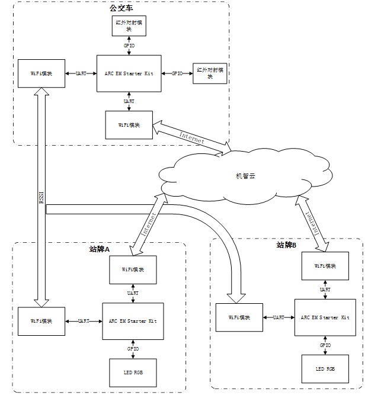

# intelligent-bus-stop
ARC参赛项目
智能公交站牌

智能公交站牌是一款能够显示车到站的位置，以及公交车的拥挤程度，可以给候车人提供很多便利的公交站牌。智能公交站牌以ARC处理器为核心，借助WIFI模块以及机智云实现公交车与站牌之间的通信，并使用三色LED灯在公交站牌上显示公交车位置和车拥挤程度信息。在后期的推广过程中我们可以增加相应的功能来相应智慧城市与智慧交通的发展，比如增加语音识别系统、环境监测系统以及智能换乘等功能，最大程度方便乘客的使用。

- 概述
  - 功能
  - 系统结构
- 软件和硬件设置
  - 所需硬件
  - 所需软件
  - 硬件连接

概述

智能公交站牌

功能

- 显示公交车的到站位置信息。
- 显示公交车的拥挤程度。

系统结构

 
 

软件和硬件设置

所需硬件

- 3 DesignWare ARC EM Starter Kit(EMSK)
- 6 WiFi ESP8266 (ESP-01S)
- 8 LED RGB
- 2 Infrared radiation module
- 3 SD Card
  硬件和ARC板的接口连接如下： 

所需软件

- Metaware or ARC GNU Toolset
- Serial port terminal, such as putty, tera-term or minicom
- Gizwits

硬件连接

EMSK 1实现公交车车上人数计数功能，通过上车红外对射模块扫到的数据减去下车红外对射模块的数据。我们可以得到车载人数。

- Pmod1，Pmod5与WiFi连接
- Pmod2，Pmod3，Pmod4和Pmod5与LED RGB连接。
  EMSK 2和EMSK 3实现公交站牌车到站位置的显示和车上拥挤程度的显示，通过站牌上WiFi扫到公交车上WiFi发出的rssi信号和接收机智云发送的数据。我们可以通过灯的位置已经颜色显示车的到站位置和车载拥挤程度。
- Pmod1与红外对射模块和WiFi模块连接，
- Pmod2与红外对射模块连接， Pmod5与WiFi连接。

